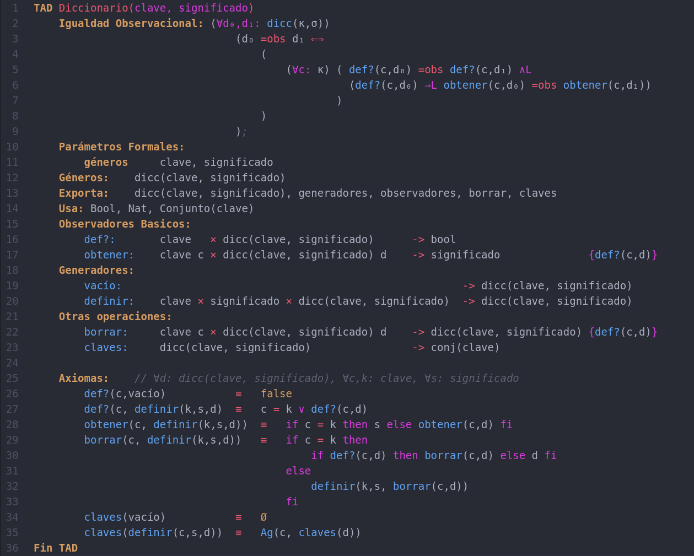
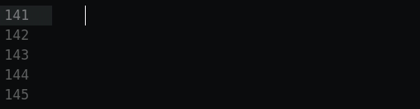

# Sintaxis para escribir TADs en Atom
[](https://github.com/luisbustamante097/language-tad-aed2/blob/master/CHANGELOG)
[](https://github.com/luisbustamante097/language-tad-aed2/blob/master/LICENSE)
[](https://atom.io/packages/language-tad-aed2)

Un intento de crear la sintaxis usada en AED2-FCEN-UBA para la escritura de TADs en Atom.




**(Disclaimer)** (Actualizado 20/08/2021)
- Este paquete fue creado solo con la intención de tener una mejor visualización de la escritura en computadora y tiene tantas fallas como uno se puede imaginar dado que creé la sintaxis desde cero sin ningún conocimiento en el tema (y en un corto lapso de tiempo).
- No recomiendo la escritura de los ejercicios en computadora porque nada le gana al buen lápiz y papel, pero dado el contexto de virtualidad en el que se creó este paquete (1er cuatrimestre 2021) puede serle útil a las personas que les gusta llevar todo en la compu. (esta recomendación viene a consecuencia de que en el contexto de presencialidad uno se puede mal acostumbrar a hacer los ejercicios en la computadora, lo cual juega en contra a la hora de un examen presencial).
- Elegí Atom, a pesar de no ser el IDE más conocido, porque fue mucho más fácil escribir el paquete para esa IDE. ~~(Aunque sé que no debería ser difícil pasarlo a Sublime Text 3 dado que ambos usan YAML para las gramáticas, pero no estoy interesado en hacerlo por lo que cualquiera puede portear mi proyecto a Sublime Text 3 (o cualquier otro IDE compatible) con el código de este repositorio.)~~ **[Ya fue porteado a Sublime Text 3](https://github.com/Sponja-/Algo2-Sintaxis-TAD-st3)**. Gracias [Sponja-](https://github.com/Sponja-)!! (Yo no mantengo tal repo, pero está actualizado hasta la v1.0.1)
- Desde el [Issues](https://github.com/luisbustamante097/language-tad-aed2/issues) del repo me pueden informar acerca de cualquier problema que tengan, y están más que invitados a mandarme un PR con la solución a cualquier bug.
- **IMPORTANTE**: Se debe usar el caracter TAB en vez de los espacios para indentación de los TADs.

# Instalación 
## Instalación Manual (Windows, Mac y Linux)
1. Para hacer uso del paquete es necesario descargar Atom desde su página oficial: https://atom.io/ (Está disponible para Windows, Mac y Linux)
2. Una vez instalado lo inician, ingresan al menu de preferencias con el shortcut `Ctrl+,` (`","` hace referencia al caracter "coma") o desde su menu correspondiente en `Edit->Preferences`
3. Luego clickean en la pestaña `Install` y buscan el paquete `language-tad-aed2`, clickean en `Install` del paquete y listo! Ya pueden usar la sintaxis en cualquier archivo `.tad`

## Instalación Rapida
Primero descargan Atom desde https://atom.io/ y una vez instalado realizan lo siguiente para instalar el paquete:
- **Linux**: Instalan el paquete mediante el siguiente codigo en su terminal:
```bash
apm install language-tad-aed2
```
- **Mac**: Primero hacen lo que se indica en este [enlace](https://apple.stackexchange.com/a/131349), y luego escriben el mismo comando usado para Linux en su terminal.
- **Windows**: Desde una ventana de Powershell o CMD pueden usar el mismo comando para Linux (Atom debe estar cerrado).

# Features
## Snippets para usar símbolos matemáticos
Cargué la extensión con todos los símbolos que me parecieron necesarios para la construcción de TADs y para la parte de diseño.
Una lista de ellas (con su correspondiente atajo) es brindado en la siguiente tabla. Nótese que se utiliza para todas el prefijo "\\" a modo de asimilar la notación de Latex.

Símbolo | Atajo|Símbolo | Atajo
--------|------|--------|------
∨   | \lor                      | ×   | \cross
∨L  | \oLuego                   | ∞   | \infty
∧   | \land                     | ↦   | \function
∧L  | \yLuego                   | ≡   | \equiv
¬   | \not                      | ≠   | \notequal
∀   | \forall                   | Ø   | \emptyset
∃   | \exists                   | β   | \beta
∄   | \notexists                | α   | \alpha
⇒   | \implies                  | •   | \dot
⇒L  | \impluego                 | ◦   | \emptydot
↔   | \iff                      | π   | \pi
⇐⇒  | \iffalt                   | ←   | \gets o \ig o ("<-" + TabKey)
∴   | \porlotanto               | →   | \rarrow
∩   | \cap o \intersection      | ≤   | \leq
∪   | \cup o \union             | ≥   | \geq
⊆   | \subseteq                 | κ   | \kappa
⊂   | \subset                   | σ   | \sigma
⊄   | \notsubset                | ⟨⟩  | \tupla
∈   | \in                       | Ω   | \omega
∉   | \notin                    | ω   | \omega_2
ℕ   | \natural                  | Θ   | \theta  
ℤ   | \entero                   |
ℚ   | \racional                 | 
ℝ   | \real                     | 
ℂ   | \complejo                 | 

## Atajos
Ademas de la lista de simbolos se puede usar los snippets para insertar:
- Esqueleto de `if • then • else • if`: solo con escribir `if` o `ifthen` para la version inline.


- Esqueleto de TAD: solo con escribir `esqueloTad` se puede obtener un modelo basico de TAD para rellenar.


- Subindices para las variables: se pueden usar para tener mejor visualización de las variables usando por ejemplo `\0` para obtener un `₀`.


- Esqueleto para Igualdad Observacional: solo con escribir `igobs` se puede obtener un modelo basico de la sección para rellenar.


# Extendida para trabajar con Rep, Abs e Interfaz
**¡Podés hacer los ejercicios de la Práctica 3 en Atom!** _(y tal vez el resto de las prácticas también)._ Todas las nuevas características fueron inyectadas sobre la anterior versión de la extensión, por lo que se puede trabajar con TADs y Diseño en el mismo archivo .tad.
Toda la sintaxis está basada en los apuntes "Diseño jerárquico de TADs" y "Apuntes de Módulos Básicos" de la cátedra de AED2.
~~Aún sigo testeando que ande todo correctamente por lo que hay (muchísimos) bugs que iré solucionando con el tiempo~~, por lo que se recomienda no colgar en actualizar la extensión (saldrá un cartel en Atom cada que haya nueva actualización de cualquier extensión).

_(Lamentablemente no puedo darle el tiempo que quería para seguir mejorandola. Igualmente así como está cumple bien todas las funciones. Si encuentran errores me los pueden informar y los arreglaré a la brevedad.)_


**OBS:** Si alguna de las secciones no cierra bien su sintaxis particular se puede escribir el siguiente terminador `---` para cerrar correctamente dichas secciones (mi idea es quitar la necesidad de esto, pero por lo pronto lo dejo así).

## Snippets
- Solo con teclear `nueva interfaz` podrán tener una esqueleto de una interfaz de ejemplo para completar.
- Para la etapa de codeo se tienen snippets para estructuras del paradigma imperativo como: `while do`, `for` y `switch`.
- Snippet simple para la declaración de funciones, solo con escribir `function` se generara el siguiente esqueleto:
```vhdl
function NuevaOP(param) 
    // code
end function
```

